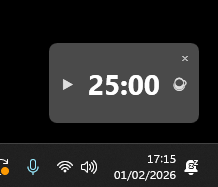
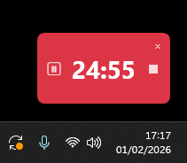
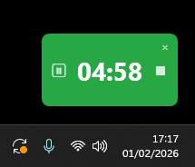
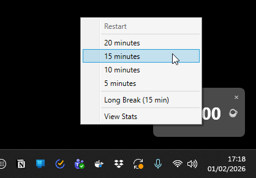
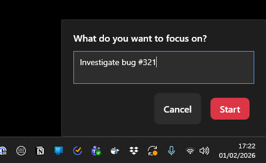
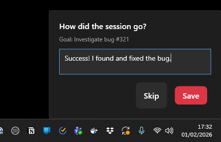
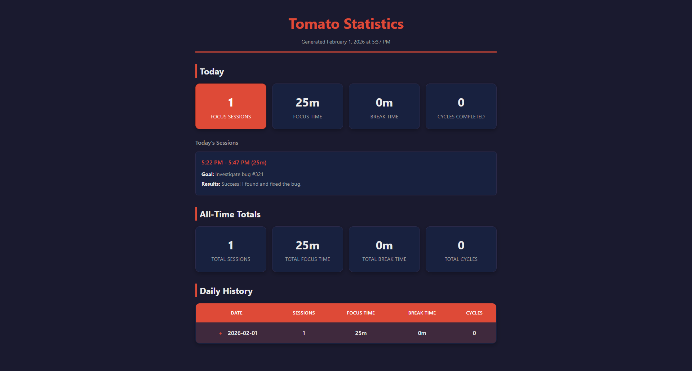

# Tomato

A minimal Windows desktop Pomodoro timer.


## Features

- 25-minute focus sessions with short and long breaks
- 4-session cycles (Focus → Break → Focus → Break → Focus → Break → Focus → Long Break)
- Goal setting dialog when starting a focus session
- Results dialog when a focus session completes
- Session statistics tracking with historical data
- View Stats report (right-click → View Stats) - generates an HTML report with:
  - Today's stats (sessions, focus time, break time, cycles)
  - Today's individual sessions with goals and results
  - All-time totals
  - Daily history with expandable session details
- Sound notifications on session completion
- State persistence across restarts
- Compact, always-on-top window
- Slack integration - automatically sets status and enables Do Not Disturb during focus sessions

## Screenshots

### Non-intrusive always-on-top display






### Custom times



### Pomodoro goal and feedback entry




### Report generation



## Slack Integration

Tomato can automatically update your Slack status and enable Do Not Disturb when you start a focus session.

### Setup

1. Create a Slack App at [api.slack.com/apps](https://api.slack.com/apps)
2. Add the following OAuth scopes under "User Token Scopes":
   - `users.profile:write` - to set your status
   - `dnd:write` - to enable Do Not Disturb
3. Install the app to your workspace and copy the "User OAuth Token" (starts with `xoxp-`)
4. Run `Tomato.exe --setup-slack` and paste your token
5. Click "Test Connection" to verify it works, then "Save"

### Behavior

- **Focus session starts**: Status changes to 🍅 "Focus time" and DND is enabled
- **Focus session ends**: Status is cleared and DND is disabled
- **Breaks**: No changes to Slack status

Your token is stored encrypted using Windows DPAPI at `%LOCALAPPDATA%\Tomato\slack.json`.

## Download

Download the latest release from the [Releases](https://github.com/dracan/tomato/releases) page.

Extract the zip and run `Tomato.exe`.

## Building from Source

Requires [.NET 8.0 SDK](https://dotnet.microsoft.com/download/dotnet/8.0).

```bash
dotnet build Tomato.sln
dotnet run --project Tomato/Tomato.csproj
```

## Running Tests

```bash
dotnet test Tomato.sln
```
